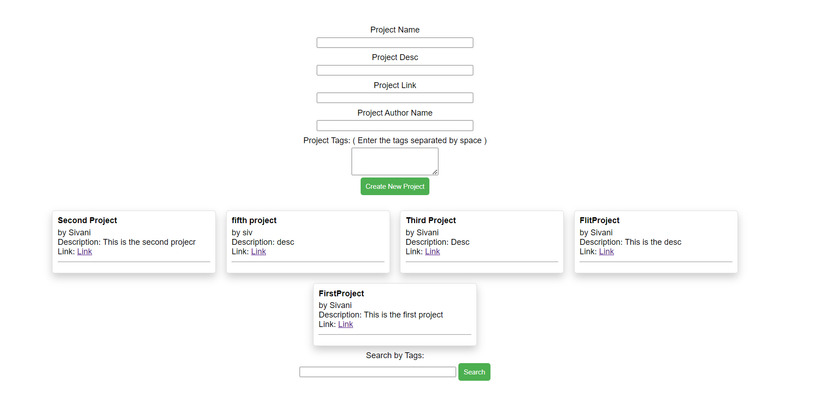

# TinkerSpace-Wit

The backend for the WIT TinkerHub created during Women in Tech Summit at 18-19 November 2023. The backend was created using Firebase. 

## Features

- Users can enter their project details.
- Submitted projects are displayed.
- Filter through the submitted projects through the tags.

